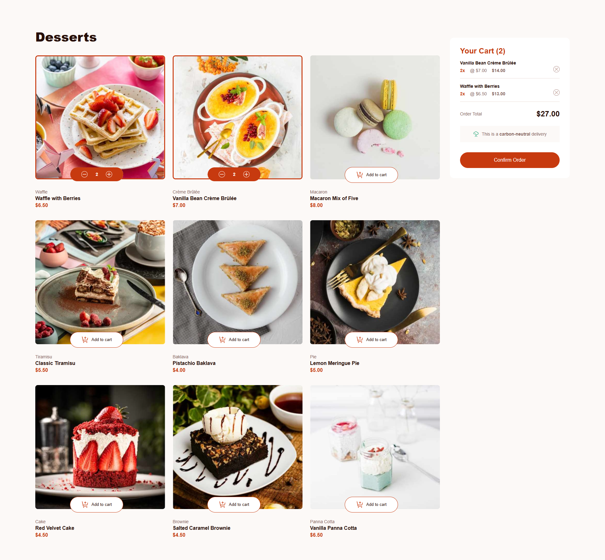
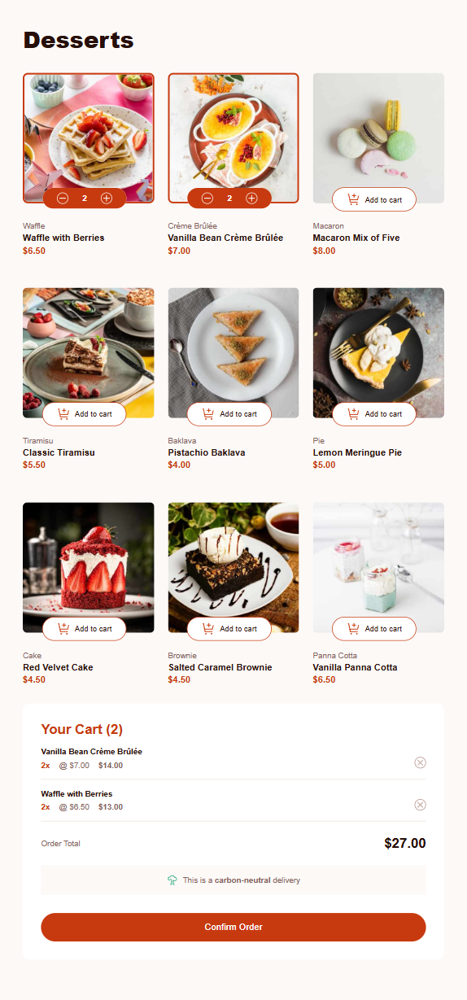
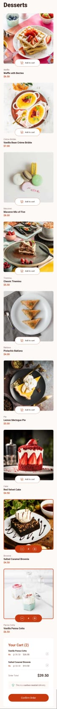

# Frontend Mentor - Product list with cart solution

This is a solution to the [Product list with cart challenge on Frontend Mentor](https://www.frontendmentor.io/challenges/product-list-with-cart-5MmqLVAp_d). Frontend Mentor challenges help you improve your coding skills by building realistic projects. 

## Table of contents

- [Overview](#overview)
  - [The challenge](#the-challenge)
  - [Screenshot](#screenshot)
  - [Links](#links)
- [My process](#my-process)
  - [Built with](#built-with)
  - [What I learned](#what-i-learned)
  - [Continued development](#continued-development)
  - [Useful resources](#useful-resources)
- [Author](#author)

## Overview

### The challenge

Users should be able to:

- Add items to the cart and remove them
- Increase/decrease the number of items in the cart
- See an order confirmation modal when they click "Confirm Order"
- Reset their selections when they click "Start New Order"
- View the optimal layout for the interface depending on their device's screen size
- See hover and focus states for all interactive elements on the page

### Screenshot

### Links

- Solution URL: [GitHub](https://github.com/DrakeHermit/product-list)
- Live Site URL: [Live Site](https://your-live-site-url.com)

## My process

### Built with

- Semantic HTML5 markup
- CSS custom properties
- Flexbox
- CSS Grid
- Mobile-first workflow
- [React](https://reactjs.org/) - JS library

### What I learned

I learned a lot building out this project, and it was a great experience for me to build it out and fix all the bugs I came across. Adding in the increasing difficulty of using TS and trying to figure out the context/reducer pattern and I had my work cut out for me for sure. I honestly feel like my logic was actually much better than the design. I had quite a bit of problems with CSS which I already thought I knew quite well. But the harder the design file is the more I learn. I would honestly appreciate if someone explained to me how I should make the pictures smaller while keeping the grid intact. I also wrote utility functions that I can reuse over my codebase, and I also added two custom hooks to make it easier for me to work with my context/reducer and to add products in the cart into local storage.
Overall I learned a ton and I also learned how little I actually understand some topics which I intend to get better at going forward.

### Continued development

My plan is to keep on improving my react knowledge, along with learning TS better. I also want to start using either css modules or maybe even tailwind since it's becoming a hassle to constantly switch between the component I'm working on and the css file.

## Author

- Frontend Mentor - [@DrakeHermit](https://www.frontendmentor.io/profile/DrakeHermit)